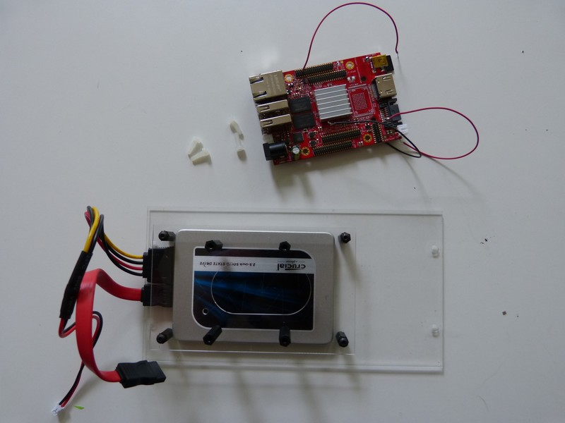

## Matériel nécessaire 
* Carte Olimex A20
* Platine F2
* 2 vis blanches plastique M3x10  

 ## Assemblage 
 
1. Positionnez le disspateur de chaleur face à au disque et les quatre trous face aux entretoises. Puis vissez les 4 vis blanches afin de fixer la carte à la platine F2  
 
3. Vu final sur la carte fixé à la platine F2  
