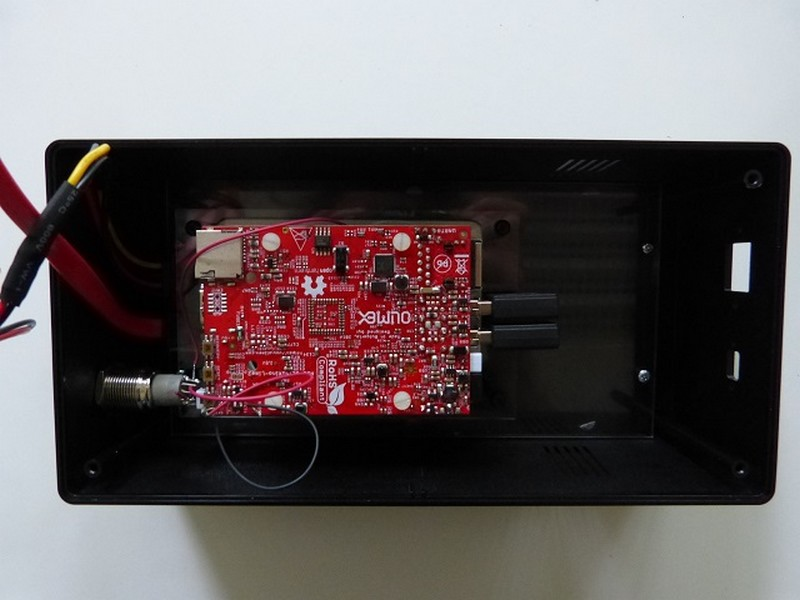
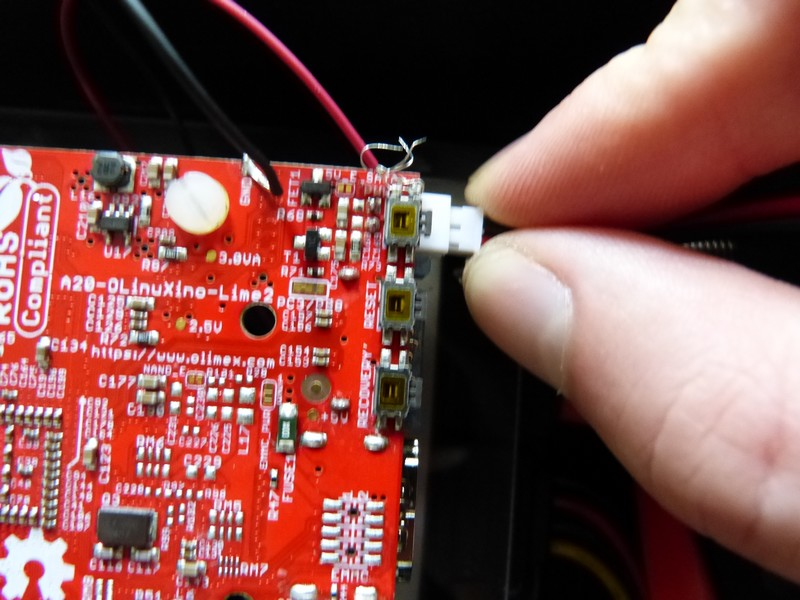
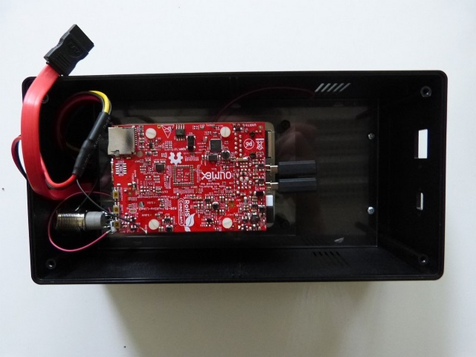
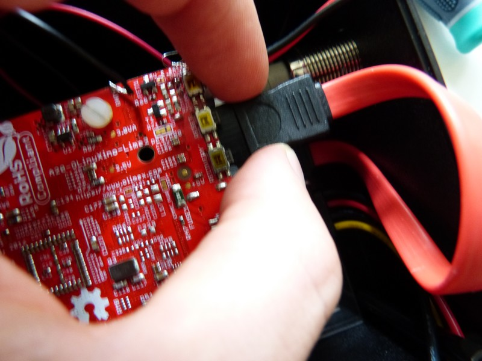
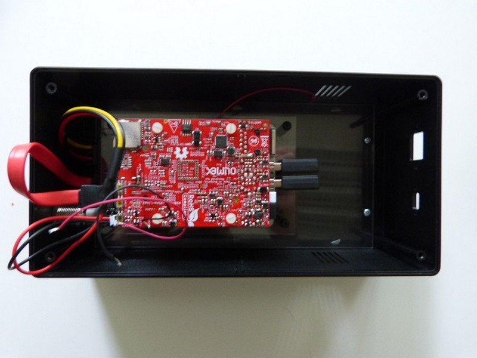

## Matériel nécessaire

* Câble SATA \(rouge\)
* Câble d'alimentation
* Carte Olimex A20

>>>> Les câbles ont un sens, bien vérifier avant de forcer au risque d'abîmer la connectique.

## Assemblage

1. Repérer un connecteur blanc située sour l'interrupteur précédement soudé. Connectez le câble d'alimentation. 
>>>> Ce connecteur possède un détrompeur  

	
3. Procéder de la même manière pour le connecteur rouge SATA. 
>>>> Ce connecteur possède un détrompeur  

   
   

