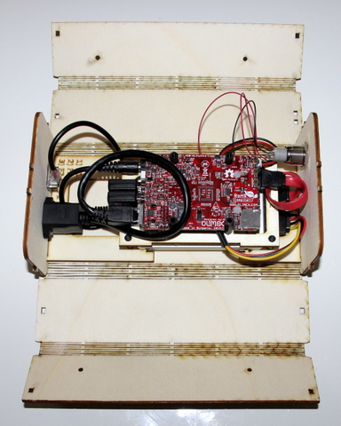

Le KoomBook est un appareil fonctionnant sur batterie et diffusant des contenus vidéos, textes, images, cours en ligne, à l'aide d'un hotspot wifi.

Une interface web intégrée permet à quiconque possédant un ordinateur, une tablette ou un smartphone de s'y connecter et de naviguer à travers les contenus disponible.

Cet outil permet à des populations ne disposant d'aucune connexion Internet d'accéder malgré tout à des ressources numériques. Il a par exemple été déployé en Côte d'Ivoire, au Cameroun, au Sénégal, etc.

[Les ressources numériques installées sur le Koombook](https://github.com/ideascube/ansiblecube) sont issues de projets libres \(wikipedia, kan academy, etc.\) et présentées par un logiciel libre lui aussi, [ideascube](https://github.com/ideascube/ideascube). 

L'objectif de cette documentation est de présenter étape par étape l'assemblage d'un KoomBook

