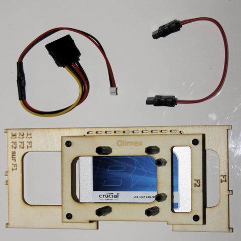
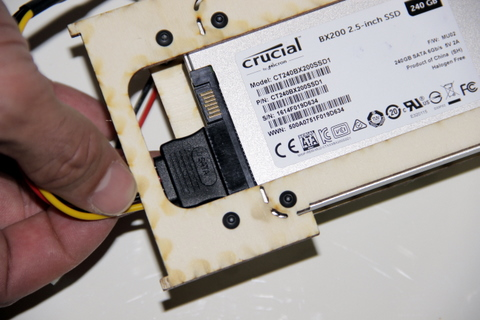
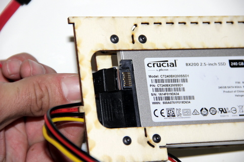
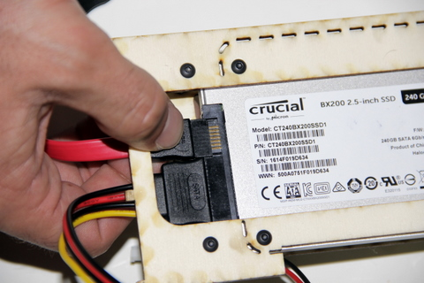

## Equipment needed

* \(Red\) SATA cable
* Power cable \(4 wires: 2 black, 1 red and 1 yellow\)
* Assembled F1 and F2 deck

## Assembly

1. Position the widest end of the power cable against the hard disk. 
   >>> The cable and disk have foolproof devices to ensure correct insertion only. Ensure the right ends are matched up before fully inserting them.    
      
2. When they are correctly matched, insert
      
   completely.    
      
3. Repeat this step for the red SATA cable.    
      
      
       
4. The power cable and SATA cable, correctly installed.    
      
5. Top view.    
    
