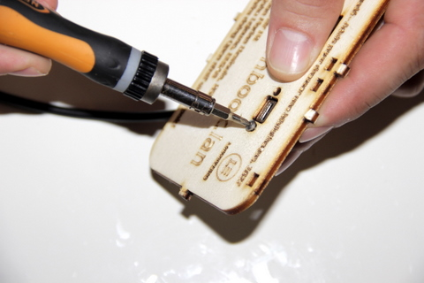
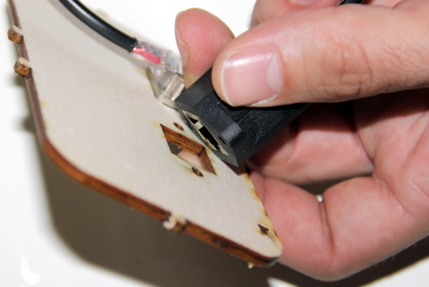

## Equipment needed
- Micro USB socket
- Black cable (with round plug)
- Front-mounted RJ45 Ethernet socket
- Back side of casing
- 2 B&F metal screws (Fastener Supply PMSSS 256 0025 PH)

## Assembly

1. Position the micro USB socket as indicated in the photo. Use the little foolproof devices on the sides to help you.     
    
2. Use your index finger to hold the micro USB socket in place. Insert the first metal screw through the front side and tighten. Repeat this step for the second screw.     
    
3. Position the Ethernet connector as indicated in the photo.     
    
4. Screw it onto the board using the two screws provided.     
    

