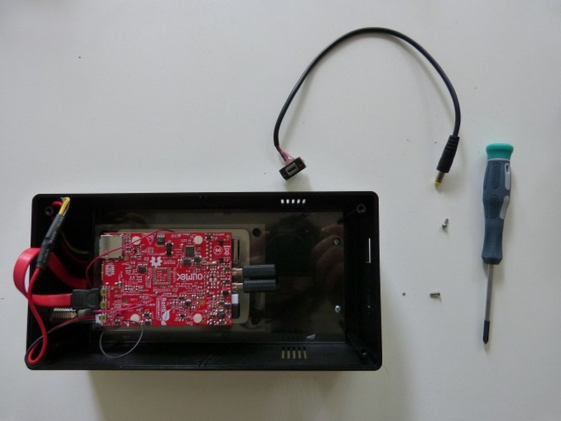
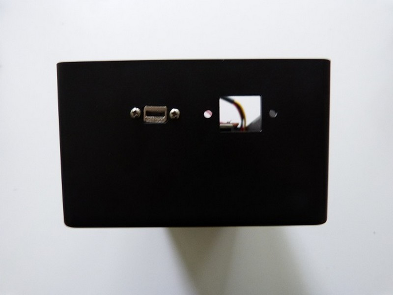
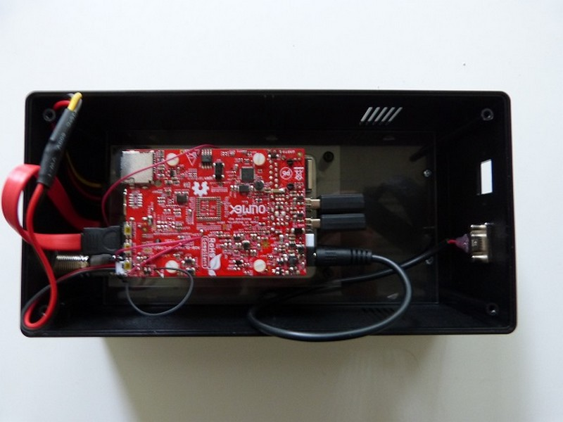

## Matériel nécessaire

* Platine F1
* 4 vis métal à tête plate M3x5 \(ø3mm, longueur 5mm\)
* 4 entretoises filetées HEX NYLON 6 FEMELLES 15MM M3  

## Assemblage

1. Placez l'embase dans le trou prévu à cet effet. Et vissez.
