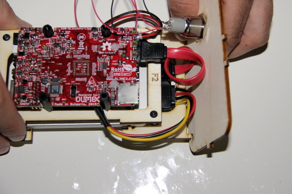
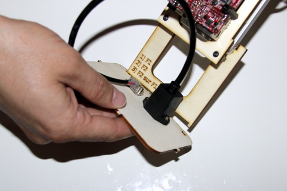
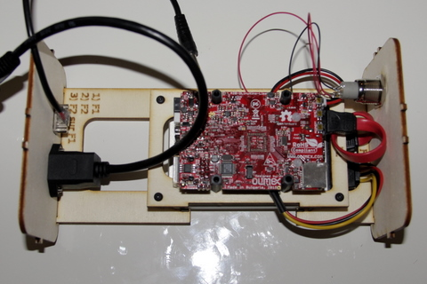

## Matériel nécessaire

* Platine F1 / F2 
* Face avant
* Face arrière 

## Assemblage

1. Positionnez la face avant du boitier dans les encoches de la platine F1  
     
2. Positionnez la face arrière du boitier dans les encoches de la platine F1  
     
3. Vu en position monté 
>>>>  Le boitier à ce niveau de montage est assez fragile, le manier avec précaution

  

