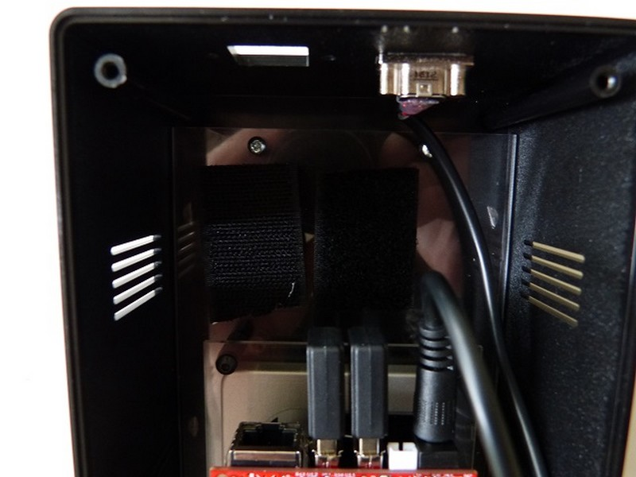
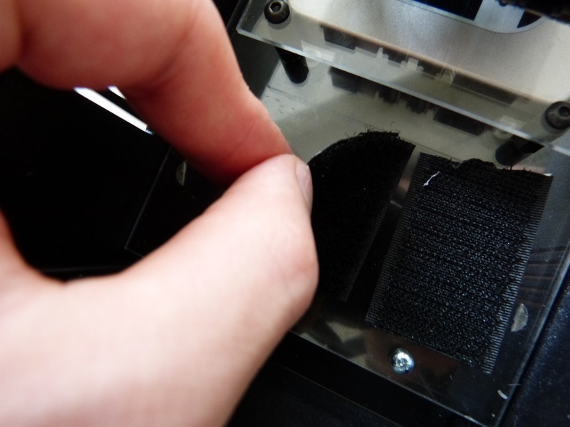

## Matériel nécessaire

* Batterie LiPo
* Scratch adhésif

## Assemblage

1.Coupez des morceaux de scratch adhésif
	
2.Placez les bout de scratch adhésif sur l'espace libre de la platine F1
	
3. Accrochez la batterie dessus. Et branchez son cable à la carte.
	